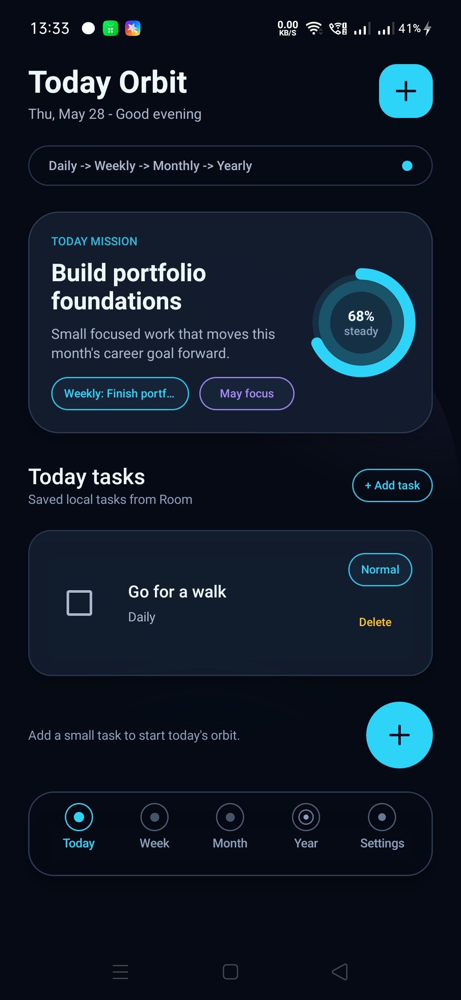
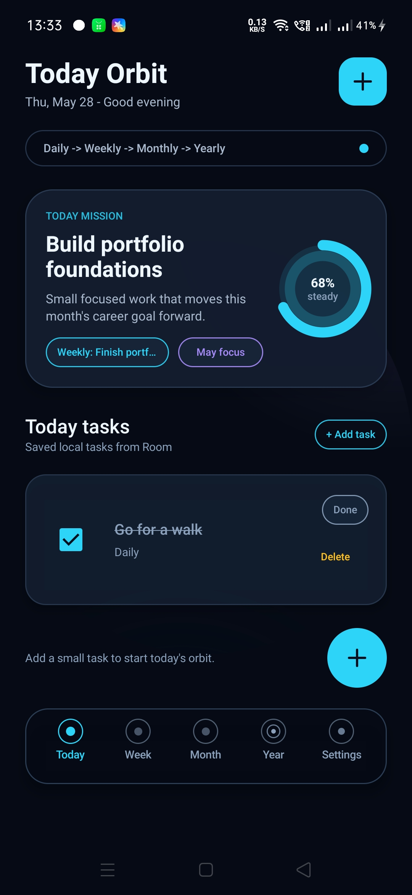
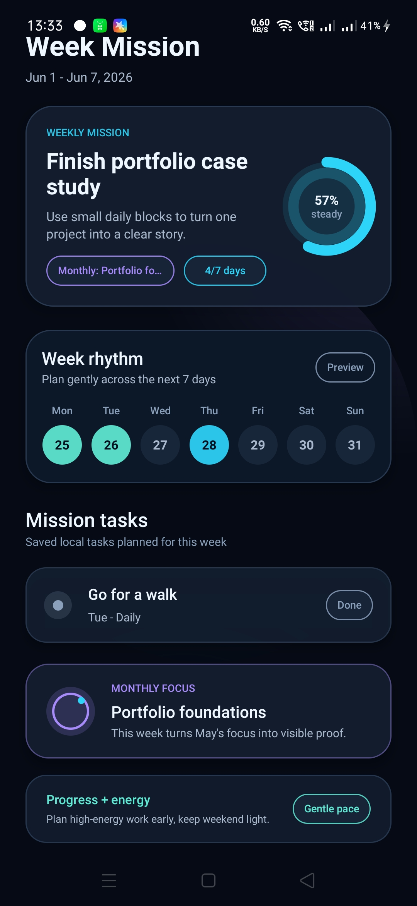
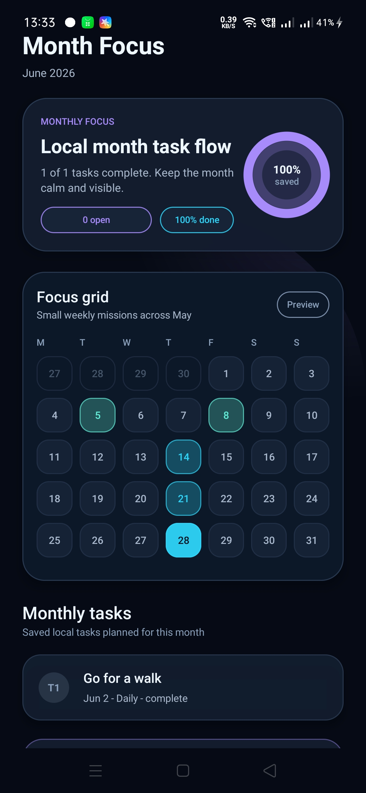
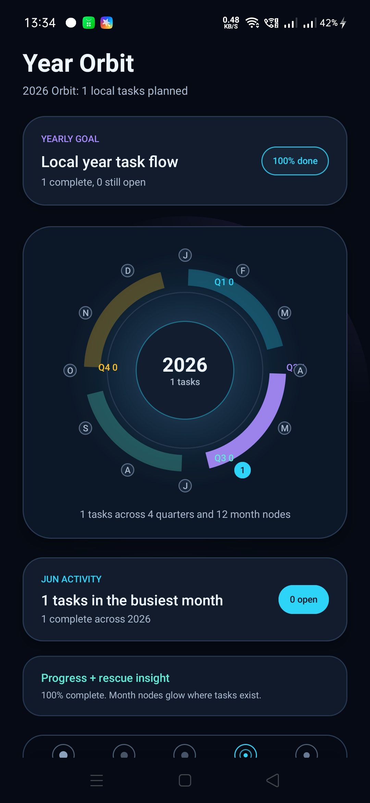
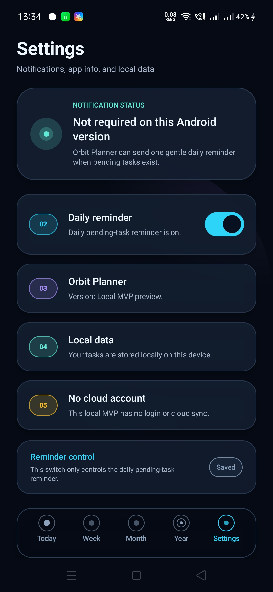

# Orbit Planner

Orbit Planner is a local/offline Android productivity MVP that connects daily task planning with a bigger life-planning flow:

`Daily tasks -> Weekly planning -> Monthly planning -> Year Orbit -> Rescue Mode`

The app is built around a calm planning idea: small daily tasks should connect to longer-term goals, and overdue work should be recovered gently instead of treated like failure.

## Current MVP Status

- Local/offline MVP completed.
- Manual QA passed.
- Portfolio/demo-ready.
- No login or cloud sync yet.
- No Play Store release yet.

This project is currently best understood as a local Android MVP and portfolio project, not a production app or Play Store release.

## Core Features

- Add task.
- Blank task validation.
- Complete and uncomplete task.
- Delete task.
- Today filtering.
- Week planning summary.
- Month planning summary.
- Year Orbit summary.
- Rescue Mode for overdue incomplete tasks.
- Daily pending task reminder using WorkManager.
- Settings notification toggle and status.
- Local data and no-cloud explanation.

## Tech Stack

- Kotlin.
- Jetpack Compose.
- Room.
- ViewModel.
- Repository pattern.
- WorkManager.
- Android notifications.
- SharedPreferences.
- Material-style UI.
- Gradle.

## Architecture Summary

Orbit Planner uses a beginner-friendly Android architecture:

- Compose screens render the main app flows: Today, Week, Month, Year Orbit, Rescue Mode, and Settings.
- Shared UI components keep repeated visual pieces easier to reuse.
- The Room database layer stores tasks locally on the device.
- The repository layer gives the rest of the app a simple way to read and update task data.
- The ViewModel layer connects UI actions to repository operations.
- A WorkManager notification worker handles the daily pending-task reminder.
- Settings storage uses SharedPreferences for the daily reminder toggle.

The current app keeps the architecture intentionally simple so the MVP stays readable and easy to review.

## Screens and App Flow

- Today: add tasks, view today's local tasks, complete/uncomplete tasks, delete tasks, and open Rescue Mode when overdue tasks exist.
- Week: view a weekly planning summary based on local task data.
- Month: view a monthly planning summary based on local task data.
- Year Orbit: view yearly task activity across month and quarter visuals.
- Rescue Mode: recover overdue incomplete tasks by moving them to today, tomorrow, the weekend, or deleting them with confirmation.
- Settings: view notification status, toggle the daily reminder, and read local data/no-cloud information.

## Screenshots

Real screenshots from the local/offline MVP, captured from the running app:

| Today | Completed Task | Week |
| --- | --- | --- |
|  |  |  |

| Month | Year Orbit | Settings |
| --- | --- | --- |
|  |  |  |

## How to Run Locally

1. Clone this repository.
2. Open the project in Android Studio.
3. Let Android Studio sync Gradle.
4. Select the app module or app run configuration.
5. Run the app on an Android emulator or a physical Android device.

No backend, account, or cloud setup is required for the current MVP.

## Known Limitations

- No login or cloud sync yet.
- No Play Store release yet.
- No Navigation Compose yet.
- No Hilt/DI yet.
- No advanced recurring tasks.
- No exact alarms.
- No per-task reminders.
- No analytics.

These limitations are intentional for the current local/offline MVP.

## Future Roadmap

Optional future ideas:

- Screenshot and demo asset capture.
- Portfolio case study.
- Advanced task features.
- Cloud sync and login later.
- Play Store preparation later.

Future work should stay small and focused so the project remains beginner-safe and easy to review.

## Portfolio Note

This project is built as a portfolio/local MVP to demonstrate Android development with local persistence, planning flows, notifications, and beginner-safe architecture.
